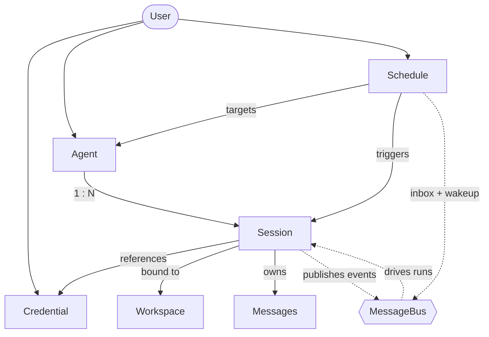
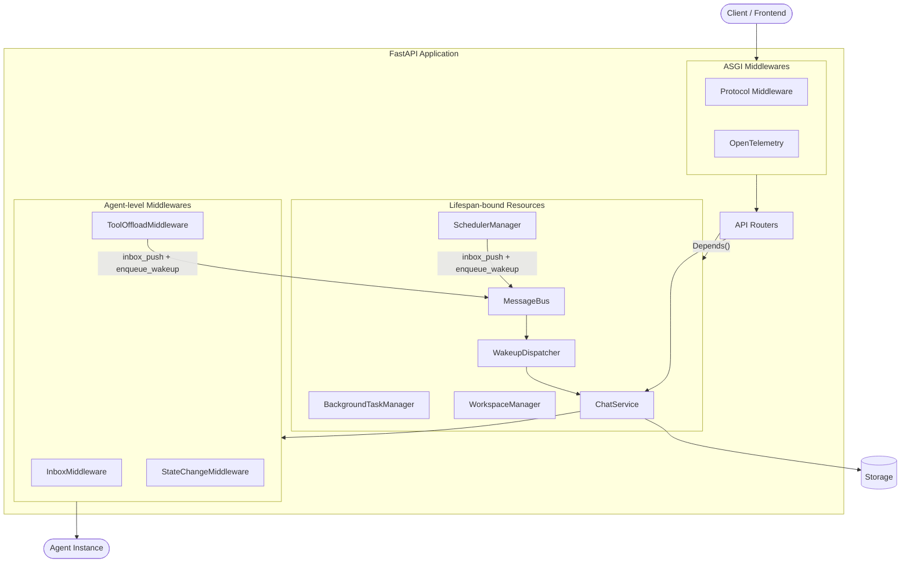

> ## Documentation Index
> Fetch the complete documentation index at: https://docs.agentscope.io/llms.txt
> Use this file to discover all available pages before exploring further.

# 智能体服务

> 把智能体部署为多租户、多会话的 HTTP 服务

智能体服务（Agent Service）是基于 FastAPI 把 AgentScope 的智能体转化为**多租户（Multi-tenant）、多会话（Multi-session）的 HTTP 服务**。它接管智能体*外围*的全部职责 —— 请求路由、按用户的资源生命周期、会话（Session）状态、持久化、调度（Schedule），以及工具调用的卸载，让基于 [`Agent`](/zh/v2/building-blocks/agent) 编写的代码无需重写即可承接生产流量。

它的特点：

* **生产级智能体框架** —— 智能体运行、后台任务、调度，以及工具 / MCP / skill / 工作区（Workspace）生命周期端到端纳管，会话事件流可扇出给多个订阅者，重连时还能从缓冲区中重放历史。
* **Schema 驱动的前端** —— 凭证（Credential）公开 JSON schema，模型暴露声明式卡片（输入 / 输出类型、上下文长度、参数 schema），前端无需绑死特定 provider 的代码即可渲染表单与能力标签。
* **天然多租户** —— 凭证、智能体、会话、调度、消息都归属于请求的 `user_id`，所有权在路由层强制；一份部署即可服务多用户，无需为每个租户单独编写代码路径。
* **模块化、可扩展** —— 鉴权（Authentication）、聊天协议、工作区隔离策略、存储后端，以及模型 provider 与凭证类型集合，全部在边界处开放，可在不动框架代码的前提下替换。

### 能力概览

| 能力                                                | 说明                                                                                      |
| ------------------------------------------------- | --------------------------------------------------------------------------------------- |
| 智能体团队（Agent Team）                                 | Leader 智能体派生 worker 智能体，并通过内置 team 工具协调它们；详见 [Agent Team](/zh/v2/deploy/agent-team) 章节。 |
| 工作区管理                                             | 可插拔的工作区隔离策略（内置：智能体隔离；可扩展为按会话或用户隔离），管理智能体的文件系统、MCP client 与 skill。                       |
| 后台任务卸载（Background Task Offloading）                | 长耗时工具调用切到后台执行，完成时通过会话事件流回送结果。                                                           |
| Cron 调度                                           | 按时间触发智能体执行，支持有状态或无状态会话；调度持久化保存，跨重启生效。                                                   |
| 会话回放（Session Replay）                              | 后接入的客户端订阅按会话 SSE 流时，会先收到缓冲历史再接收实时事件，多 tab 或重连前端因此保持同步。                                  |
| 协议适配（Protocol Adaptation）                         | 通过中间件（Middleware）在 AgentScope 原生事件流之上转换为外部协议（AG-UI、A2A 等）。                              |
| 分布式部署 <Badge color="yellow" size="sm">WIP</Badge> | 全部共享状态保存在 Redis（存储 + 消息总线（Message Bus））中，多个 worker 进程 —— 或多台节点 —— 可以服务同一个逻辑服务。          |

<Note>
  本服务**不**自带用户鉴权系统。它提供 `X-User-ID` header 占位依赖，由开发者替换为自己的鉴权中间件（JWT、OAuth、session token 等）。
</Note>

## 快速上手

体验智能体服务最快的方法是同时运行随仓库附带的示例后端与示例前端 —— 两者都在 AgentScope 仓库内。

### 试用示例

[`examples/agent_service`](https://github.com/agentscope-ai/agentscope/tree/main/examples/agent_service) 目录启动一个开箱即用的服务，[`examples/web_ui`](https://github.com/agentscope-ai/agentscope/tree/main/examples/web_ui) 是与之配套的 React 前端。两者一起运行，几分钟就能体验上述全部能力。

<Frame caption="后台任务卸载 —— 长耗时工具被转入后台，结果到达后唤醒智能体，对话从中断处自然续上。">
  
</Frame>

<Frame caption="bypass 模式下的权限系统 —— 智能体端到端运行，不为工具调用暂停确认。">
  
</Frame>

<Frame caption="任务规划 —— 智能体把复杂工作拆成可追踪的计划，并随执行不断更新。">
  
</Frame>

<Frame caption="智能体团队 —— Leader 智能体派生 worker，并通过内置 team 工具协调它们。">
  
</Frame>

<Steps>
  <Step title="克隆仓库">
    ```bash theme={null}
    git clone https://github.com/agentscope-ai/agentscope.git
    cd agentscope
    ```
  </Step>

  <Step title="启动示例后端">
    确保本地 Redis 可访问（示例期望 `localhost:6379`），然后启动服务：

    ```bash theme={null}
    cd examples/agent_service
    python main.py
    ```

    服务在 `http://localhost:8000` 启动。
  </Step>

  <Step title="启动示例前端">
    在另一个终端中安装并运行 web UI：

    ```bash theme={null}
    cd examples/web_ui
    pnpm install
    pnpm dev
    ```

    打开 dev server 输出的 URL（通常是 `http://localhost:5173`），前端会连接到第 2 步启动的后端。
  </Step>
</Steps>

两者运行起来后，同一个 UI 即可演练服务自带的全部能力：

* **权限控制** —— 触及系统的工具会暂停等待确认；explore 模式将智能体限定在只读操作。
* **后台任务卸载** —— 长耗时工具调用转入后台，完成后结果流式返回，不阻塞对话。
* **任务规划** —— 智能体把复杂工作拆成可追踪的计划并随执行更新。
* **智能体团队** —— Leader 智能体派生 worker，并通过 team 工具协调他们。
* **计划任务** —— Cron 驱动的智能体自行触发并把结果回报到同一会话流中。

### 嵌入到自己的代码

如果想把服务嵌入到自己的部署中而非运行示例，可使用 `create_app` 自行构造 FastAPI app。运行起一个服务至少需要存储后端、消息总线与工作区管理器（Workspace Manager）。下面的示例在 8000 端口启动一个由 Redis 支撑的服务 —— 选择匹配智能体工具执行位置的工作区后端即可。

<CodeGroup>
  ```python 本地文件系统 theme={null}
  import uvicorn
  from agentscope.app import create_app
  from agentscope.app.storage import RedisStorage
  from agentscope.app.message_bus import RedisMessageBus
  from agentscope.app.workspace_manager import LocalWorkspaceManager

  # Agent、session、credential、message、schedule 的持久化层。
  # 连接池在应用启动时打开、关闭时关闭。
  storage = RedisStorage(host="localhost", port=6379)

  # Redis 支撑的消息总线：session 锁、回放日志、收件箱队列与
  # 唤醒信号，将 chat 触发与事件投递解耦，
  # 让多个 worker 进程能共享同一个逻辑 service。
  message_bus = RedisMessageBus(host="localhost", port=6379)

  # Workspace 生命周期 —— 工作目录、MCP client、skill。
  # 内置 manager 按 agent 隔离：同一 agent 的所有 session 共享一个 workspace。
  # 空闲 workspace 经过 `ttl` 秒后被淘汰。
  workspace_manager = LocalWorkspaceManager(
      basedir="/data/workspaces",
      ttl=3600.0,
  )

  app = create_app(
      storage=storage,
      message_bus=message_bus,
      workspace_manager=workspace_manager,
  )

  uvicorn.run(app, host="0.0.0.0", port=8000)
  ```

  ```python Docker 沙箱 theme={null}
  import uvicorn
  from agentscope.app import create_app
  from agentscope.app.storage import RedisStorage
  from agentscope.app.message_bus import RedisMessageBus
  from agentscope.app.workspace_manager import DockerWorkspaceManager

  storage = RedisStorage(host="localhost", port=6379)
  message_bus = RedisMessageBus(host="localhost", port=6379)

  # 每个 workspace 跑在独立的本地 Docker 容器中实现隔离。
  # 按用户 / agent 划分的宿主工作目录位于 `basedir` 下，挂载进各容器。
  workspace_manager = DockerWorkspaceManager(basedir="/data/docker-workspaces")

  app = create_app(
      storage=storage,
      message_bus=message_bus,
      workspace_manager=workspace_manager,
  )
  uvicorn.run(app, host="0.0.0.0", port=8000)
  ```

  ```python E2B theme={null}
  import uvicorn
  from agentscope.app import create_app
  from agentscope.app.storage import RedisStorage
  from agentscope.app.message_bus import RedisMessageBus
  from agentscope.app.workspace_manager import E2BWorkspaceManager

  storage = RedisStorage(host="localhost", port=6379)
  message_bus = RedisMessageBus(host="localhost", port=6379)

  # 每个 workspace 跑在远端 E2B 云沙箱中。
  # 通过 `api_key` 显式传入，或设置环境变量 `E2B_API_KEY`。
  workspace_manager = E2BWorkspaceManager()

  app = create_app(
      storage=storage,
      message_bus=message_bus,
      workspace_manager=workspace_manager,
  )
  uvicorn.run(app, host="0.0.0.0", port=8000)
  ```
</CodeGroup>

### create\_app 参数

<ParamField path="storage" type="StorageBase" required>
  持久化智能体、会话、凭证、消息、调度的存储后端。其生命周期（`__aenter__` / `__aexit__`）由应用 lifespan 管理。
</ParamField>

<ParamField path="message_bus" type="MessageBus" required>
  Redis 支撑的运行时原语 —— 会话锁、回放日志、收件箱队列、唤醒信号 —— 把 chat 触发与事件投递解耦。必填，因为所有把事件投递到前端的代码路径（`POST /chat`、调度触发、团队消息、后台工具完成）都经由它，且它是支撑多进程部署的关键。
</ParamField>

<ParamField path="workspace_manager" type="WorkspaceManagerBase" required>
  以 TTL 缓存方式管理工作区（文件存储、MCP server、skill）。内置 `LocalWorkspaceManager` 按智能体隔离；其他策略见[工作区实现与隔离](#工作区实现与隔离)。
</ParamField>

<ParamField path="extra_credentials" type="list[Type[CredentialBase]] | None" default="None">
  额外注册的凭证类型。每个类在应用启动前被注入 `CredentialFactory`。
</ParamField>

<ParamField path="extra_middlewares" type="list[Middleware] | None" default="None">
  额外的 ASGI 中间件（例如协议适配器、CORS、鉴权）。
</ParamField>

<ParamField path="extra_agent_middlewares" type="AgentMiddlewareFactory | None" default="None">
  异步工厂 `(user_id, agent_id, session_id) -> Awaitable[list[MiddlewareBase]]`，在每次组装智能体（即每轮 chat 或每次 schedule 触发）时被调用一次。返回的中间件会在智能体运行前追加到框架自带的中间件（例如 `ToolOffloadMiddleware`）之后，可用于产出按用户 / 会话区分的中间件，比如审计日志、租户隔离或自定义鉴权逻辑。
</ParamField>

<ParamField path="extra_agent_tools" type="AgentToolFactory | None" default="None">
  异步工厂 `(user_id, agent_id, session_id) -> Awaitable[list[ToolBase]]`，在每次组装智能体时被调用一次。返回的工具会与工作区派生的工具一起合并到 toolkit 的 `"basic"` 分组里，便于按调用者动态决定可用工具（例如按租户接入、按用户使用各自凭证的工具）。
</ParamField>

<ParamField path="sub_agent_templates" type="list[SubAgentTemplate] | None" default="None">
  团队中子智能体创建的可复用蓝图。每个模板定义了一个子智能体*类型*（例如 `"researcher"`、`"coder"`），预设了系统提示词、权限上下文与任务上下文。注册后，`AgentCreate` 工具会暴露 `subagent_type` 参数，使 leader 智能体可以路由到相应的模板。详见[自定义子智能体类型](/zh/v2/deploy/agent-team#自定义子智能体类型)。
</ParamField>

<ParamField path="title" type="str" default="AgentScope">
  OpenAPI 文档界面中显示的标题。
</ParamField>

<ParamField path="version" type="str" default="2.0.0">
  OpenAPI 文档界面中显示的 API 版本号。
</ParamField>

<Warning>
  默认的 `X-User-ID` header 不提供任何鉴权。生产部署前请替换为真实的鉴权方案 —— 见[用户鉴权](#用户鉴权)。
</Warning>

### 典型操作流程

服务启动后，按资源模型中定义的资源驱动它即可。下面是一次聊天会话通常走过的路径 —— 每一步是一两次 REST 调用。

<Steps>
  <Step title="创建智能体">
    注册智能体身份 —— 展示名、system prompt 与运行时配置。同一智能体可以在不同模型下驱动多个会话。

    ```http theme={null}
    POST /agent
    ```
  </Step>

  <Step title="创建并配置凭证">
    通过 `GET /credential/schemas` 发现各 provider 的表单字段，再保存 API key。一份凭证可以在多个会话与智能体中复用。

    ```http theme={null}
    GET  /credential/schemas
    POST /credential
    ```
  </Step>

  <Step title="创建会话并选择模型">
    创建一个绑定到该智能体的会话，并附上模型配置 —— provider、模型名称、参数，以及调用所用的凭证。从此之后由会话拥有运行时状态。

    ```http theme={null}
    POST /sessions
    ```
  </Step>

  <Step title="配置 MCP 与 skill（可选）">
    若智能体需要超出内置范围的工具，向会话的工作区附加 MCP client 与 skill。开箱即用的情况下，每个智能体已经能访问工作区的内置工具（文件系统、shell、搜索……）、任务规划工具、调度与后台任务控制工具，以及 —— 当会话是团队 leader 或成员时 —— [Agent Team](/zh/v2/deploy/agent-team) 中描述的团队协调工具。通过 `create_app` 的 `extra_agent_tools` 传入的工具也会一并合入。

    ```http theme={null}
    POST /workspace/mcp
    POST /workspace/skill
    ```
  </Step>

  <Step title="开始聊天">
    向 `/chat` POST 一条用户 `Msg` 触发一次 chat 运行。该端点立刻返回 `{"status": "started", "session_id": "..."}` —— 事件通过按会话 SSE 流 `GET /sessions/{id}/stream` 异步投递；任意数量的客户端可订阅该流，后接入者可重放缓冲历史再接收实时事件。

    ```http theme={null}
    POST /chat
    GET  /sessions/{session_id}/stream
    ```
  </Step>
</Steps>

触发一次运行：

```bash theme={null}
curl -X POST http://localhost:8000/chat \
  -H "X-User-ID: alice" \
  -H "Content-Type: application/json" \
  -d '{
    "agent_id": "agent-xxx",
    "session_id": "session-xxx",
    "input": {
      "name": "alice",
      "role": "user",
      "content": [{"type": "text", "text": "Hello"}]
    }
  }'
```

并行订阅该会话的事件流（也可以在触发前订阅 —— 该流跨多次运行保持打开，并广播会话产出的所有事件，包括调度触发与后台工具完成）：

```bash theme={null}
curl -N -H "X-User-ID: alice" \
  "http://localhost:8000/sessions/session-xxx/stream?agent_id=agent-xxx"
```

对于**计划任务**，完成步骤 1 与 2 后创建一个指向智能体的 schedule —— scheduler 会按你给定的 cron 表达式创建会话（有状态或无状态）并触发执行。无需调用 `/chat`；cron 触发时智能体自动运行。

```http theme={null}
POST /schedule
```

## 资源模型

智能体服务中的每次操作都归属于从请求中解析出的 `user_id`。在该边界之下，服务管理七类资源 —— 六类持久化资源（图左侧）加把它们运行时行为串起来的消息总线（图右侧）：



| 资源             | 说明                                                                                       |
| -------------- | ---------------------------------------------------------------------------------------- |
| **User**       | 从请求中解析出的不透明租户标识。服务自身不建模用户系统；通过 `get_current_user_id` 接入自己的实现。                            |
| **Credential** | 某个模型 provider 的连接配置 —— 一个 API key 加上 provider 特有设置。可在多个智能体与会话间复用。                        |
| **Agent**      | 展示名、system prompt 与运行时配置（context、ReAct 循环）。可复用的模板 —— 身份属于智能体，运行时状态属于会话。                  |
| **Workspace**  | 智能体的运行时环境 —— 工作目录、MCP client、skill、卸载的上下文。工作区如何映射到 user / agent / session 由工作区管理器决定。     |
| **Session**    | 用户与智能体之间一次正在进行的会话。承载智能体状态（工作记忆、未完成的 reply、permission context）、持久化消息记录，以及该会话运行所用的 LLM 配置。 |
| **Schedule**   | 按 cron 表达式触发智能体。每次触发都在一个会话内运行 —— 可以每次新建（无状态），也可以复用以让上下文跨次累积（有状态）。Schedule 可在重启后保留。       |
| **MessageBus** | Redis 支撑的运行时层 —— 会话锁、回放日志、收件箱队列、唤醒信号。是调度触发、团队消息与后台工具完成抵达空闲会话的唯一投递通道；也是支撑多进程运行的基础。        |

<Tip>
  要记住的形态：**智能体是可复用的模板，会话是运行时状态的承载单位**，而消息总线则是当外部事件（调度、队友、后台工具）有话要说时把空闲会话唤醒的桥梁。
</Tip>

## API 概览

服务把资源模型中的资源暴露为 REST 端点，外加流式聊天端点。下表按类别分组；完整请求与响应结构由服务的 OpenAPI 规格描述。

| 类别                 | 端点                                                                 | 说明                                                           |
| ------------------ | ------------------------------------------------------------------ | ------------------------------------------------------------ |
| Chat               | `POST /chat`                                                       | 触发某会话的一次 chat 运行；返回 `ChatTriggerResponse` JSON。事件通过按会话流异步投递。 |
| Session stream     | `GET /sessions/{id}/stream`                                        | 按会话的 `AgentEvent` SSE 流，支持后接入者的缓冲回放与多订阅者扇出。                  |
| Sessions           | `GET/POST/PATCH/DELETE /sessions`                                  | 创建与管理聊天会话，包括模型绑定与 permission level。                          |
| Messages           | `GET /sessions/{id}/messages`                                      | 分页拉取某会话的消息记录。                                                |
| Agents             | `GET/POST/PATCH/DELETE /agent`                                     | 管理智能体记录 —— 展示名、system prompt、运行时配置。                          |
| Credentials        | `GET/POST/PATCH/DELETE /credential`                                | 各 provider 的 API key 与连接配置 CRUD。                             |
| Credential schemas | `GET /credential/schemas`                                          | 发现已注册的全部凭证类型及其 JSON 参数 schema，用于表单渲染。                        |
| Models             | `GET /model?provider=<name>`                                       | 列出某 provider 下的候选模型，附带声明式 `ModelCard`（能力与参数 schema）。         |
| Schedules          | `GET/POST/PATCH/DELETE /schedule`、`GET /schedule/{id}/sessions`    | 管理 cron 触发的智能体执行，有状态或无状态。                                    |
| Workspace MCPs     | `GET/POST /workspace/mcp`、`DELETE /workspace/mcp/{mcp_name}`       | 管理挂在会话工作区上的 MCP client。                                      |
| Workspace skills   | `GET/POST /workspace/skill`、`DELETE /workspace/skill/{skill_name}` | 管理会话工作区中可用的 skill。                                           |

## 自定义

服务在每个基础设施边界上都开放扩展。下面分节说明哪些是内置的，以及如何插入自己的实现。

### 智能体聊天协议

按会话流端点（`GET /sessions/{id}/stream`）通过 SSE 输出 AgentScope 原生的 [`AgentEvent`](/zh/v2/building-blocks/message-and-event) 流。要让同一智能体服务于不同前端协议，安装协议中间件拦截 SSE 流并改写每帧。

AgentScope 内置 `AGUIProtocolMiddleware` 适配 [AG-UI](https://docs.ag-ui.com/) 协议。通过 `extra_middlewares` 装载：

```python theme={null}
from fastapi.middleware import Middleware
from agentscope.app import create_app, AGUIProtocolMiddleware

app = create_app(
    storage=storage,
    extra_middlewares=[
        Middleware(AGUIProtocolMiddleware),
    ],
)
```

新增协议时，继承 `ProtocolMiddlewareBase` 并实现 `_convert_to_protocol`：

```python theme={null}
from agentscope.app import ProtocolMiddlewareBase
from agentscope.event import AgentEvent

class MyProtocolMiddleware(ProtocolMiddlewareBase):
    def _convert_to_protocol(self, event: AgentEvent) -> dict:
        # 把 AgentEvent 转换为目标协议的帧格式。
        return {"type": event.type, "data": event.model_dump()}
```

中间件自动拦截会话流端点返回的 `StreamingResponse`，把每条 SSE 帧反序列化回 `AgentEvent`，调用 `_convert_to_protocol()` 生成目标格式后重新序列化。

### 用户鉴权

内置的 `get_current_user_id` 依赖从请求 header `X-User-ID` 中读取调用者身份 —— 这是占位实现，不是真正的鉴权。用自己的依赖覆盖即可对接任何身份系统。

JWT bearer token：

```python theme={null}
from fastapi import Header, HTTPException, status

async def get_current_user_id(
    authorization: str = Header(...),
) -> str:
    try:
        payload = decode_jwt(authorization.removeprefix("Bearer "))
        return payload["sub"]
    except InvalidTokenError:
        raise HTTPException(
            status_code=status.HTTP_401_UNAUTHORIZED,
            detail="Invalid authentication token.",
        )
```

OAuth2 password flow：

```python theme={null}
from fastapi import Depends, HTTPException, status
from fastapi.security import OAuth2PasswordBearer

oauth2_scheme = OAuth2PasswordBearer(tokenUrl="token")

async def get_current_user_id(token: str = Depends(oauth2_scheme)) -> str:
    user = await verify_oauth_token(token)
    if user is None:
        raise HTTPException(status_code=status.HTTP_401_UNAUTHORIZED)
    return user.id
```

通过 FastAPI 的依赖覆盖机制把自定义实现挂上去：

```python theme={null}
from agentscope.app.deps import get_current_user_id as default_dependency

app.dependency_overrides[default_dependency] = get_current_user_id
```

<Warning>
  默认的 `X-User-ID` header 不提供鉴权。生产部署前请始终替换为安全机制。
</Warning>

### 工作区实现与隔离

可独立配置两条正交维度：

* **工作区后端** —— 智能体实际运行所在的运行时环境。内置实现包括 `LocalWorkspace`、`DockerWorkspace`、`E2BWorkspace`。新增后端实现工作区接口即可，可包装容器镜像、沙箱或远端虚拟机。
* **隔离策略** —— 工作区如何映射到 user、agent、session。内置 `LocalWorkspaceManager` 以 `agent_id` 为键：同一智能体的所有会话共享一个工作区。要切换为按 user 或按 session 隔离，继承 `WorkspaceManagerBase` 并按自己的键策略覆写 `get_workspace`。

```python theme={null}
from agentscope.app.workspace_manager import WorkspaceManagerBase
from agentscope.workspace import WorkspaceBase


class PerSessionWorkspaceManager(WorkspaceManagerBase):
    async def get_workspace(
        self,
        user_id: str,
        agent_id: str,
        session_id: str,
        workspace_id: str,
    ) -> WorkspaceBase:
        # 取出已初始化的工作区；按 session_id 作键以实现按会话隔离。
        ...

    async def create_workspace(
        self,
        user_id: str,
        agent_id: str,
        session_id: str,
    ) -> WorkspaceBase:
        # 分配新的工作区并写入缓存。
        ...

    async def close(self, workspace_id: str) -> None:
        # 关闭并淘汰单个工作区。
        ...

    async def close_all(self) -> None:
        # 关闭全部缓存中的工作区；应用关闭时调用。
        ...
```

### API 凭证

新增凭证类型由两类组成：一个 `CredentialBase` 子类负责描述连接配置（并发布 JSON schema 用于表单渲染），一个 `ChatModelBase` 子类实现针对该 provider API 的流式聊天协议。凭证类是入口 —— 它告诉服务该实例化哪个 chat model 类。

```python theme={null}
from agentscope.credential import CredentialBase
from agentscope.model import ChatModelBase

class MyProviderChatModel(ChatModelBase):
    # 针对 provider API 实现流式聊天接口。
    ...

class MyProviderCredential(CredentialBase):
    api_key: str
    endpoint: str = "https://api.my-provider.com"

    @classmethod
    def get_chat_model_class(cls):
        return MyProviderChatModel
```

把凭证类注册到 app 上，客户端立即可用：

```python theme={null}
app = create_app(
    storage=storage,
    extra_credentials=[MyProviderCredential],
)
```

服务自动通过 `GET /credential/schemas` 暴露该凭证的 JSON schema，`GET /model?provider=<name>` 路由到 `get_chat_model_class()` 返回的 chat model 类。

### Provider 模型

`GET /model?provider=<name>` 返回的模型列表由 `ModelCard` 实例构成 —— 这是声明式元数据记录，告诉前端如何展示每个模型、哪些请求参数合法。每个 chat model 通过 `list_models()` 暴露自己的目录，默认从 provider 模型目录下的 YAML 文件中读取 `ModelCard` 项；`ModelCard.from_yaml()` 解析每份 YAML，并把其中的 overrides 合并进 chat model 参数类提供的基础参数 schema。

ModelCard 包含以下字段：

| 字段                     | 说明                                                       |
| ---------------------- | -------------------------------------------------------- |
| `name`                 | provider 侧的模型标识。                                         |
| `label`                | UI 中显示的名称。                                               |
| `status`               | `active`、`deprecated`、`sunset` 之一。                       |
| `deprecated_at`        | 弃用时间戳，如有。                                                |
| `input_types`          | 模型接收的 MIME 类型（例如 `text/plain`、`image/png`、`video/mp4`）。  |
| `output_types`         | 模型输出的 MIME 类型（例如 `text/plain`、`application/x-thinking`）。 |
| `context_size`         | 上下文窗口的最大 token 数。                                        |
| `output_size`          | 最大输出 token 数。                                            |
| `parameter_schema`     | 请求参数的 JSON schema，自动与各模型 overrides 合并。                   |
| `parameters_overrides` | 叠加在基础参数 schema 之上的各模型差异。                                 |

下面的 YAML 示例描述一个接受文本、图像、视频，并输出文本与思考链路的多模态模型：

```yaml qwen3.6-plus.yaml theme={null}
name: qwen3.6-plus
label: Qwen3.6-Plus
status: active

input_types:
  - text/plain
  - application/x-thinking
  - image/bmp
  - image/jpeg
  - image/png
  - image/tiff
  - image/webp
  - image/heic
  - video/mp4

output_types:
  - text/plain
  - application/x-thinking

context_size: 1000000
output_size: 65536

parameter_overrides:
  max_tokens: {"maximum": 65536}
```

要在已有 provider 下新增模型，把 YAML 文件丢进 provider 模型目录即可 —— loader 会自动拾取，新条目会出现在 `GET /model?provider=<name>` 中。

### 存储后端

`StorageBase` 抽象类定义了智能体、会话、凭证、消息、调度的持久化契约。AgentScope 内置 `RedisStorage` 实现：

```python theme={null}
from agentscope.app.storage import RedisStorage

storage = RedisStorage(
    host="localhost",
    port=6379,
    db=0,
    password="your-password",
)
```

要换用其他数据库，实现同一接口即可：

```python theme={null}
from agentscope.app.storage import StorageBase


class PostgresStorage(StorageBase):
    async def __aenter__(self):
        # 打开连接池。
        ...

    async def __aexit__(self, exc_type, exc_val, exc_tb):
        # 关闭连接池。
        ...

    # 为每类记录实现 CRUD 方法：
    # agent、session、credential、message、schedule、team。
    ...

app = create_app(
    storage=PostgresStorage(dsn="postgresql://..."),
    message_bus=message_bus,
    workspace_manager=workspace_manager,
)
```

存储层管理的记录类型：

| 记录                 | 说明                                                     |
| ------------------ | ------------------------------------------------------ |
| `AgentRecord`      | 智能体配置（name、system prompt、context config、react config）。 |
| `SessionRecord`    | 会话状态，包含 `AgentState`、模型配置与工作区绑定。                       |
| `CredentialRecord` | 加密保存的模型 provider API key。                              |
| `ScheduleRecord`   | Cron schedule 定义及执行历史。                                 |
| `TeamRecord`       | 团队身份、leader 绑定与 worker 成员列表。                           |
| `Msg`              | 按会话持久化的消息，支持分页。                                        |

## 服务内部结构

如果开发者需要在 AgentScope 中扩展或嵌入智能体服务的实际实现，本节描述 FastAPI 应用是如何拼装起来的 —— 启动时跑哪些逻辑、由哪些 manager 持有运行时状态、中间件在请求路径中的位置，以及 router 如何拿到这些资源。



### Lifespan

Lifespan context manager 每个进程仅运行一次。基于 `AsyncExitStack` 构建，启动时按顺序进入资源 —— storage → message bus → workspace manager → background task manager → scheduler manager → chat service → wakeup dispatcher —— 关闭时按相反顺序拆除。如果任何启动步骤抛错，已进入的资源仍会被妥善清理。Scheduler 在进入时会恢复持久化的 cron 任务以保证它们跨重启生效。

### Manager

下列资源在 lifespan 期间被绑定到 FastAPI 应用状态上，所有请求共享：

| 资源                      | 职责                                                                                                    |
| ----------------------- | ----------------------------------------------------------------------------------------------------- |
| `MessageBus`            | Redis 支撑的运行时原语（会话锁 + 回放日志、收件箱队列、唤醒信号）。是调度触发、团队消息与后台工具完成抵达空闲会话的唯一投递通道；也是支撑多进程运行的基础。                    |
| `WakeupDispatcher`      | 每个进程一个。订阅唤醒信号，对每条入队的唤醒驱动 `ChatService.run` 处理目标会话。                                                    |
| `BackgroundTaskManager` | 纯 asyncio 任务注册表。`ToolOffloadMiddleware` 在此派生 watcher 任务；结果通过消息总线（inbox + wakeup）回送，而不是保留在该 manager 中。 |
| `SchedulerManager`      | 基于 APScheduler 的 cron 执行。触发时，trigger 会向目标会话的收件箱推一个 `HintBlock` 并入队一个唤醒 —— 不直接调用 `ChatService`。        |
| `WorkspaceManager`      | 工作区生命周期与 TTL 缓存；隔离键（按 agent、按 user、按 session）由子类决定。                                                   |
| `ChatService`           | 运行会话的唯一入口。加载记录、组装 toolkit、构建中间件、获取消息总线会话锁，并驱动智能体的 reply 流。                                            |

### 中间件

两个独立的中间件层在不同作用域上运作。

**ASGI 中间件**包裹每次 HTTP 请求。实际场景中常见两类：**协议中间件**（例如 `AGUIProtocolMiddleware`），拦截会话流端点的 SSE 响应并把每帧改写为目标协议；**可观测性中间件**（例如 OpenTelemetry tracing）。两者都通过 `extra_middlewares` 安装。

**智能体层中间件**包裹 `ChatService` 内对智能体的每次调用，暴露在 `agentscope.app.middleware` 下；框架始终安装三个：

* `InboxMiddleware` —— hint 注入的唯一所有者。每次推理步骤前会清空会话收件箱，并把队列中的 `HintBlock` 以 `HintBlockEvent` 形式 yield 出来，让调度触发、团队消息与卸载工具结果都通过同一路径流入智能体上下文。
* `ToolOffloadMiddleware` —— 工具调用超时后会被转入后台 watcher 任务，并向智能体 yield 一个合成占位结果。当 watcher 完成时，结果连同唤醒被推回会话收件箱，下一次运行时被取走。
* `StateChangeMiddleware` —— 在智能体状态发生变化时（例如 `tasks_context`、`permission_context`）发出 `CustomEvent`，让前端无需读取原始状态快照即可作出反应。

要添加自己的中间件（审计日志、租户隔离、自定义鉴权……），向 `create_app` 传入 `extra_agent_middlewares` 工厂。该工厂在每次组装智能体时被调用一次，其返回的中间件会追加到框架自带的之后。

### 依赖

Router 通过 FastAPI 的 `Depends()` 拿到应用状态。标准注入项（位于 `agentscope.app.deps`）如下：

| 依赖                            | 返回                                      |
| ----------------------------- | --------------------------------------- |
| `get_current_user_id`         | 调用者的 user id —— 可被覆盖以对接任意鉴权系统。          |
| `get_storage`                 | 绑定在 app 上的 `StorageBase` 实例。            |
| `get_message_bus`             | 绑定在 app 上的 `MessageBus` 实例。             |
| `get_workspace_manager`       | 由 lifespan 绑定的 `WorkspaceManager`。      |
| `get_background_task_manager` | 由 lifespan 绑定的 `BackgroundTaskManager`。 |
| `get_scheduler_manager`       | 由 lifespan 绑定的 `SchedulerManager`。      |
| `get_chat_service`            | 由 lifespan 绑定的 `ChatService`。           |

## 延伸阅读

<CardGroup cols={2}>
  <Card title="Agent" icon="robot" href="/zh/v2/building-blocks/agent">
    核心智能体抽象与 ReAct 循环
  </Card>

  <Card title="Message & Event" icon="envelope" href="/zh/v2/building-blocks/message-and-event">
    事件流与消息重建
  </Card>

  <Card title="Tool" icon="wrench" href="/zh/v2/building-blocks/tool">
    内置与自定义工具，包括外部执行
  </Card>

  <Card title="Context" icon="database" href="/zh/v2/building-blocks/context">
    上下文压缩与工作区 offloading
  </Card>
</CardGroup>