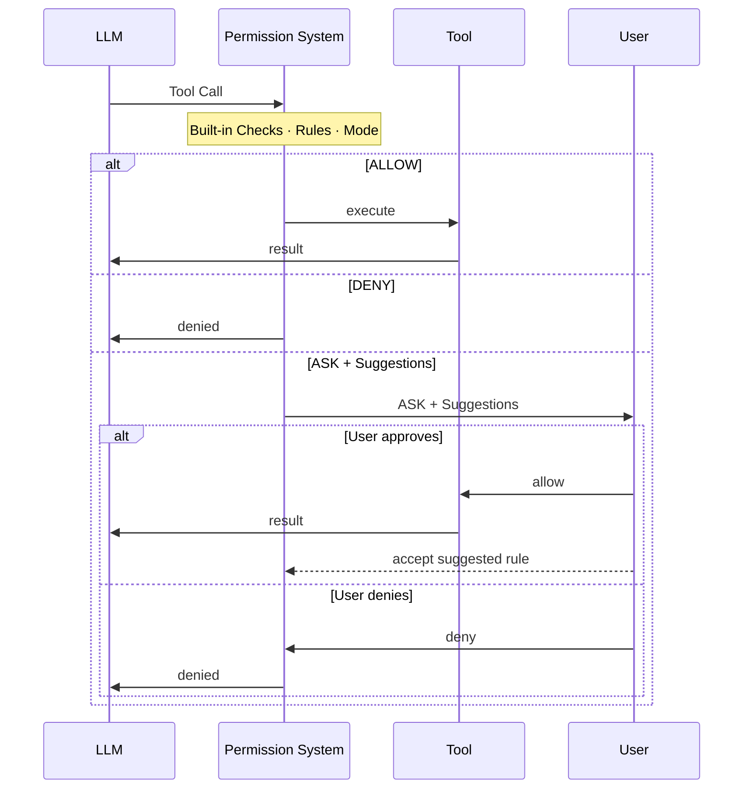

> ## Documentation Index
> Fetch the complete documentation index at: https://docs.agentscope.io/llms.txt
> Use this file to discover all available pages before exploring further.

# 权限系统

> 精细控制 agent 可以执行哪些 tool、何时执行

## 概述

Permission system 拦截 agent 的每一次工具调用，给出三种决策之一：**允许（allow）** 执行、**拒绝（deny）** 执行，或者**询问用户（ask）** 确认。

它把静态配置与动态运行时分析组合起来。三个组件共同决定结果：

* **Rules** —— 针对每个 tool 与命令的显式 allow / deny / ask 模式，最高优先级。规则有两种来源：在 `PermissionContext` 中静态预配置，或在 ASK 提示中由用户接受**建议规则**而动态加入。建议规则由本次工具调用自动生成 —— 一旦接受，将来相同的调用便会被自动处理，不再询问。
* **Mode** —— 配置阶段设定的全局静态策略；决定所有不命中任何规则的调用的默认行为（例如 `EXPLORE` 让 agent 进入只读；`DONT_ASK` 静默拒绝未命中的调用）。
* **Built-in Checks** —— 由 tool 自身在运行时基于真实输入做的动态分析：只读命令检测（在调用时解析 bash 命令）、危险路径保护（检查实际文件路径或命令目标）。工具可以通过 `PermissionDecision.bypass_immune=True` 将一次 safety ASK 标记为**不可绕过**；引擎会在 `DEFAULT`、`ACCEPT_EDITS`、`DONT_ASK` 下尊重该标记（allow rules 也无法将其静默）。`BYPASS` 模式是唯一例外 —— 它按设计明确跳过所有 safety ASK。



下面是各 mode 下的决策流程。ASK 结果会触发用户确认；如果用户接受自动生成的 suggested rule，规则会被持久化以供后续调用使用。

<Tabs>
  <Tab title="DEFAULT">
    ```mermaid theme={null}
    flowchart TD
        A([Tool Call]) --> D1{Deny Rules?}
        D1 -->|Match| DENY([DENY])
        D1 -->|No| D2{Ask Rules?}
        D2 -->|Match| ASK([ASK])
        D2 -->|No| D3[Tool check_permissions]
        D3 -->|ALLOW| ALLOW([ALLOW])
        D3 -->|DENY| DENY
        D3 -->|"Safety ASK (bypass_immune)"| ASK
        D3 -->|PASSTHROUGH / other ASK| D4{Allow Rules?}
        D4 -->|Match| ALLOW
        D4 -->|No| ASK
        style DENY fill:#ff6b6b,color:#fff
        style ALLOW fill:#51cf66,color:#fff
        style ASK fill:#ffd43b,color:#333
    ```
  </Tab>

  <Tab title="EXPLORE">
    ```mermaid theme={null}
    flowchart TD
        A([Tool Call]) --> E1{Deny Rules?}
        E1 -->|Match| DENY([DENY])
        E1 -->|No| E2{Ask Rules?}
        E2 -->|Match| ASK([ASK])
        E2 -->|No| E3{check_read_only?}
        E3 -->|True| ALLOW([ALLOW])
        E3 -->|False| DENY
        style DENY fill:#ff6b6b,color:#fff
        style ALLOW fill:#51cf66,color:#fff
        style ASK fill:#ffd43b,color:#333
    ```
  </Tab>

  <Tab title="ACCEPT_EDITS">
    ```mermaid theme={null}
    flowchart TD
        A([Tool Call]) --> AE1{Deny Rules?}
        AE1 -->|Match| DENY([DENY])
        AE1 -->|No| AE2{Ask Rules?}
        AE2 -->|Match| ASK([ASK])
        AE2 -->|No| AE3{check_read_only?}
        AE3 -->|True| ALLOW([ALLOW])
        AE3 -->|False| AE4[Tool check_permissions]
        AE4 -->|ALLOW| ALLOW
        AE4 -->|DENY| DENY
        AE4 -->|"Safety ASK (bypass_immune)"| ASK
        AE4 -->|PASSTHROUGH / other ASK| AE5{Allow Rules?}
        AE5 -->|Match| ALLOW
        AE5 -->|No| ASK
        style DENY fill:#ff6b6b,color:#fff
        style ALLOW fill:#51cf66,color:#fff
        style ASK fill:#ffd43b,color:#333
    ```
  </Tab>

  <Tab title="BYPASS">
    ```mermaid theme={null}
    flowchart TD
        A([Tool Call]) --> B1{Deny Rules?}
        B1 -->|Match| DENY([DENY])
        B1 -->|No| B2{Ask Rules?}
        B2 -->|Match| ASK([ASK])
        B2 -->|No| B3[Tool check_permissions]
        B3 -->|ALLOW| ALLOW([ALLOW])
        B3 -->|DENY| DENY
        B3 -->|"Any ASK (safety ignored) / PASSTHROUGH"| B4{Allow Rules?}
        B4 -->|Match or No| ALLOW
        style DENY fill:#ff6b6b,color:#fff
        style ALLOW fill:#51cf66,color:#fff
        style ASK fill:#ffd43b,color:#333
    ```
  </Tab>

  <Tab title="DONT_ASK">
    ```mermaid theme={null}
    flowchart TD
        A([Tool Call]) --> DA1{Deny Rules?}
        DA1 -->|Match| DENY([DENY])
        DA1 -->|No| DA2{Ask Rules?}
        DA2 -->|Match| DENY
        DA2 -->|No| DA3[Tool check_permissions]
        DA3 -->|ALLOW| ALLOW([ALLOW])
        DA3 -->|DENY| DENY
        DA3 -->|"Any ASK (incl. safety)"| DENY
        DA3 -->|PASSTHROUGH| DA4{Allow Rules?}
        DA4 -->|Match| ALLOW
        DA4 -->|No| DENY
        style DENY fill:#ff6b6b,color:#fff
        style ALLOW fill:#51cf66,color:#fff
    ```
  </Tab>
</Tabs>

<Note>
  **Deny 规则**与**显式 ask 规则**在每个 mode 下都始终生效（包括 `BYPASS`）。

  **工具发出的 safety ASK**（`bypass_immune=True`）在 `DEFAULT`、`ACCEPT_EDITS`、`DONT_ASK` 下被尊重 —— allow 规则也无法将其静默。`BYPASS` 模式按设计跳过：BYPASS 的语义是"用户已主动放弃 safety 提示；只剩 deny / ask 规则作为护栏"。
</Note>

## Permission Mode

AgentScope 支持以下模式，分别适配不同的部署场景：

| Mode           | 行为                                                                                                                                           | 适用场景         |
| -------------- | -------------------------------------------------------------------------------------------------------------------------------------------- | ------------ |
| `DEFAULT`      | 所有操作都需要显式规则或用户确认。唯一的内置自动放行路径是 `Bash` 识别只读命令（`ls`、`git status`、`cat` 等）后返回 ALLOW。`Read` / `Glob` / `Grep` 返回 PASSTHROUGH，命中不到 allow 规则仍然会 ASK | 最安全，推荐默认值    |
| `ACCEPT_EDITS` | 自动放行工作目录内的文件操作；Bash filesystem 命令（`mkdir`/`touch`/`rm`/`cp`/`mv`/`sed`）**仅当所有目标路径都在某个工作目录内**才自动放行                                            | 用户在场的活跃开发    |
| `EXPLORE`      | 只读：放行 read-only 工具与只读 Bash 命令（`ls`、`git status`、`cat` 等）；拒绝任何修改。用户配置的 DENY / ASK 规则优先级高于只读自动放行                                               | 代码探索、规划      |
| `BYPASS`       | 跳过所有权限检查，**除了** deny / ask 规则与工具自身的 DENY。**工具的 safety ASK 不会被强制**（`rm -rf /`、写入 `~/.bashrc`、命令注入等都会放行）。请用 deny 规则保护具体路径                      | 沙箱环境或完全可信的运行 |
| `DONT_ASK`     | 把所有 ASK（默认 ASK、ASK 规则、**以及** safety ASK）转为 DENY；非交互式运行下默认安全                                                                                  | 无人值守 / 计划任务  |

可以在创建 agent 时通过 `AgentState.permission_context` 设置 mode，也可以在运行时更新：

<CodeGroup>
  ```python 初始化时配置 theme={null}
  from agentscope.agent import Agent
  from agentscope.state import AgentState
  from agentscope.permission import PermissionContext, PermissionMode

  agent = Agent(
      name="my_agent",
      system_prompt="...",
      model=model,
      state=AgentState(
          permission_context=PermissionContext(
              mode=PermissionMode.DEFAULT,
          )
      ),
  )
  ```

  ```python 运行时切换 theme={null}
  # 切换到只读模式
  agent.state.permission_context.mode = PermissionMode.EXPLORE

  # 切换到无人值守模式以执行批处理
  agent.state.permission_context.mode = PermissionMode.DONT_ASK
  ```

  ```python ACCEPT_EDITS 配合工作目录 theme={null}
  from agentscope.permission import AdditionalWorkingDirectory

  agent = Agent(
      name="my_agent",
      system_prompt="...",
      model=model,
      state=AgentState(
          permission_context=PermissionContext(
              mode=PermissionMode.ACCEPT_EDITS,
              working_directories={
                  "/my/project": AdditionalWorkingDirectory(
                      path="/my/project",
                      source="userSettings",
                  )
              },
          )
      ),
  )
  ```
</CodeGroup>

## Permission Rule

`PermissionRule` 把某个 tool 与具体的调用模式映射到三种行为之一：`ALLOW`、`DENY`、`ASK`。

每条规则由下述字段组成。当权限引擎评估一条规则时，它会用 `rule_content` 与实际调用入参调用该 tool 的 `match_rule()` 方法，判断规则是否命中。

<ParamField path="tool_name" type="str" required>
  规则适用的 tool 名：`"Bash"`、`"Read"`、`"Write"`、`"Edit"`，或任意自定义 tool 名。
</ParamField>

<ParamField path="rule_content" type="str | None" required>
  匹配模式 —— 语义随 `tool_name` 变化：

  * **Bash**：通配前缀模式（`npm run:*` 命中 `npm run build`、`npm run test`）
  * **Read / Write / Edit**：glob 模式（`src/**/*.py` 命中 `src/` 下任意 `.py`）
  * **其他 tool**：对 JSON 序列化后的参数做精确匹配
</ParamField>

<ParamField path="behavior" type="PermissionBehavior" required>
  `ALLOW`、`DENY` 或 `ASK`
</ParamField>

<ParamField path="source" type="str" required>
  规则来源：`"userSettings"`、`"projectSettings"`、`"session"` 等。
</ParamField>

### 模式示例

`rule_content` 由各 tool 的 `match_rule()` 方法消费，并由 `ToolBase.generate_suggestions()` 自动生成。由于这两个方法都属于 tool 接口的一部分，每个 tool 可以独立定义自己的模式语法与匹配逻辑。

AgentScope 内置工具的模式约定如下：

<Tabs>
  <Tab title="Bash">
    针对 **`command`** 参数做匹配。模式格式为 `COMMAND_PREFIX:*` —— 前缀是命令的首段 token，`*` 匹配后续任意参数。

    | 模式             | 匹配                             | 不匹配           |
    | -------------- | ------------------------------ | ------------- |
    | `npm run:*`    | `npm run build`、`npm run test` | `npm install` |
    | `git commit:*` | `git commit -m "fix"`          | `git push`    |
    | `rm:*`         | `rm file.txt`、`rm -rf /tmp/x`  | `ls`          |

    ```python theme={null}
    PermissionRule(
        tool_name="Bash",
        rule_content="npm run:*",
        behavior=PermissionBehavior.ALLOW,
        source="userSettings",
    )
    ```
  </Tab>

  <Tab title="文件类工具（Read / Write / Edit）">
    针对 **`file_path`** 参数，通过 `fnmatch` 做 glob 匹配。

    | 模式            | 匹配                  |
    | ------------- | ------------------- |
    | `src/**`      | `src/` 下任意文件        |
    | `src/**/*.py` | `src/` 下的 Python 文件 |
    | `config.json` | 精确匹配该文件             |

    ```python theme={null}
    PermissionRule(
        tool_name="Write",
        rule_content="src/**",
        behavior=PermissionBehavior.ALLOW,
        source="userSettings",
    )
    ```
  </Tab>
</Tabs>

### 配置规则

**初始化时** —— 在创建 agent 时把规则传入 `PermissionContext`：

```python theme={null}
from agentscope.agent import Agent
from agentscope.state import AgentState
from agentscope.permission import (
    PermissionContext, PermissionMode, PermissionRule, PermissionBehavior
)

agent = Agent(
    name="my_agent",
    system_prompt="...",
    model=model,
    state=AgentState(
        permission_context=PermissionContext(
            mode=PermissionMode.DEFAULT,
            allow_rules={
                "Bash": [PermissionRule(tool_name="Bash", rule_content="npm run:*",
                                        behavior=PermissionBehavior.ALLOW, source="userSettings")],
                "Write": [PermissionRule(tool_name="Write", rule_content="src/**",
                                         behavior=PermissionBehavior.ALLOW, source="userSettings")],
            },
            deny_rules={
                "Bash": [PermissionRule(tool_name="Bash", rule_content="rm:*",
                                        behavior=PermissionBehavior.DENY, source="userSettings")],
            },
        )
    ),
)
```

**运行时通过建议规则** —— 当权限系统返回 ASK 时，会基于本次调用自动生成建议规则。把已接受的规则附在 `UserConfirmResultEvent.rules` 中回传，agent 会自动写入引擎：

```python theme={null}
from agentscope.event import UserConfirmResultEvent

# ASK 决策中包含基于本次调用生成的 suggested_rules。
# 接受建议时，把它放入结果事件即可：
result = UserConfirmResultEvent(
    confirmed=True,
    rules=[suggested_rule],  # 已接受的规则会被持久化进引擎
)
```

## Built-in Checks

每个 tool 都实现了一个 `check_permissions()` 方法，在运行时基于真实调用入参执行检查。AgentScope 内置工具覆盖三类检查：

* **危险路径保护** —— `Write`、`Edit`、`Bash` 检查目标文件或命令是否触及敏感路径。返回一个 bypass-immune 的 safety ASK，在 `DEFAULT`/`ACCEPT_EDITS`/`DONT_ASK` 下被尊重（allow 规则无法静默）。`BYPASS` 模式按设计跳过。
* **只读命令检测** —— `Bash` 解析命令字符串识别只读操作，在**所有 mode**（包括 `DEFAULT`）下自动放行。对于像 `Bash` 这种结果依赖于输入的工具，这一判定通过 `check_read_only()` 方法暴露（详见下文）。
* **ACCEPT\_EDITS 模式** —— `Write` 与 `Edit` 自动放行已配置工作目录内的文件操作。`Bash` 额外要求 filesystem 命令（`mkdir`/`touch`/`rm`/`cp`/`mv`/`sed` 等）的**所有**目标路径都在某个工作目录内。

### 自定义 tool

自定义 tool 可以重写 `check_permissions()` 添加工具特定的权限逻辑。如果工具的只读状态取决于输入（比如 `Bash` —— `ls` 是只读，`rm` 不是），还应该重写 `check_read_only()`。

```python theme={null}
from agentscope.tool import ToolBase
from agentscope.permission import PermissionContext, PermissionDecision, PermissionBehavior

class MyTool(ToolBase):
    name = "MyTool"
    # 静态默认值。对于结果取决于输入的工具，把这里设成保守默认，
    # 然后重写 check_read_only()。
    is_read_only = False

    async def check_read_only(self, tool_input: dict) -> bool:
        """可选：动态只读判定。

        默认返回 self.is_read_only。当某次调用是否修改状态取决于
        输入时进行重写。引擎用它来决定在 EXPLORE 和 ACCEPT_EDITS
        模式下是否自动放行。
        """
        return tool_input.get("operation") in {"list", "describe", "get"}

    async def check_permissions(
        self,
        tool_input: dict,
        context: PermissionContext,
    ) -> PermissionDecision:
        target = tool_input.get("target")

        # 自定义安全检查：阻止操作生产资源。
        # 设置 bypass_immune=True 让这条 ASK 在 DEFAULT / ACCEPT_EDITS /
        # DONT_ASK 下不被 allow 规则覆盖；BYPASS 模式仍然会跳过。
        if target and target.startswith("prod-"):
            return PermissionDecision(
                behavior=PermissionBehavior.ASK,
                message=f"Operation targets production resource: {target}",
                decision_reason="Safety check: production resource",
                bypass_immune=True,
            )

        # 返回 PASSTHROUGH 让引擎继续按 rules / mode 评估
        return PermissionDecision(behavior=PermissionBehavior.PASSTHROUGH)
```

### Safety check 契约

**Safety check** 是工具自己发出、认为太危险不能被静默放行的 ASK —— 例如 `Write` 到 `~/.bashrc`、`Bash` 执行 `rm -rf /`。在决策上设 `bypass_immune=True`，即使命中了 allow 规则或处于会自动放行的 mode，引擎也仍然把 ASK 浮到用户。

适用于"一次错误调用就会造成用户几乎肯定不想发生的破坏"的场景。例如：自定义的 `DeployTool` 在目标是 `prod-*` 时返回 `bypass_immune=True`，那么为 staging 配的 `allow_rules["DeployTool"] = ["*"]` 也不会意外授权生产部署。

各 mode 下的具体处理：

| Mode           | `bypass_immune=True` 的 ASK                         |
| -------------- | -------------------------------------------------- |
| `DEFAULT`      | 尊重 —— allow 规则不能将其覆盖                               |
| `ACCEPT_EDITS` | 尊重 —— 同 `DEFAULT`                                  |
| `EXPLORE`      | 不适用（EXPLORE 不会调用 `check_permissions`，只读判定就已经决断了一切） |
| `BYPASS`       | **忽略** —— BYPASS 按设计跳过所有 safety ASK                |
| `DONT_ASK`     | 转为 DENY（没有用户可以回答）                                  |

普通 ASK（`bypass_immune=False`，默认值）可以被 `DEFAULT`/`ACCEPT_EDITS` 下匹配的 allow 规则覆盖，在 `BYPASS` 下被兜底放行。

### 只读命令

常见的只读 bash 命令在没有任何规则的情况下也会被自动放行，在**所有 mode**（包括 `DEFAULT`）下都生效。复合命令（`&&`、`||`、`;`、`|`）只有在**所有**子命令都只读时才视为只读。输出重定向（`>`、`>>`）会让命令立即失去只读属性。

<AccordionGroup>
  <Accordion title="完整只读命令列表">
    | 类别         | 命令                                                                                                                |
    | ---------- | ----------------------------------------------------------------------------------------------------------------- |
    | Git        | `git status`、`git log`、`git diff`、`git show`、`git branch`、`git blame`、`git grep`、`git reflog`、`git config --list` |
    | 文件         | `ls`、`cat`、`head`、`tail`、`grep`、`rg`、`find`、`tree`、`stat`、`wc`、`pwd`、`which`                                      |
    | Docker     | `docker ps`、`docker images`、`docker logs`、`docker inspect`、`docker info`                                          |
    | GitHub CLI | `gh repo view`、`gh issue list`、`gh pr list`、`gh status`                                                           |
    | 包管理器       | `npm list`、`pip list`、`pip show`、`node --version`、`python --version`                                              |
  </Accordion>
</AccordionGroup>

### 危险路径保护

<Warning>
  针对以下路径的操作在 `DEFAULT`、`ACCEPT_EDITS`、`DONT_ASK` 下触发一个 bypass-immune 的 ASK（在 `DONT_ASK` 下被转为 DENY）。`BYPASS` 模式按设计跳过此检查 —— 如果你在 BYPASS 下仍想要危险路径保护，请为具体路径添加 deny 规则。
</Warning>

| 类别       | 路径                                                         |
| -------- | ---------------------------------------------------------- |
| Shell 配置 | `.bashrc`、`.zshrc`、`.bash_profile`、`.profile`              |
| Git 配置   | `.gitconfig`、`.gitmodules`                                 |
| SSH      | `.ssh/config`、`.ssh/authorized_keys`、`id_rsa`、`id_ed25519` |
| 凭证       | `.env`、`.env.local`、`.npmrc`、`.pypirc`、`.aws/credentials`  |
| 目录       | `.git/`、`.ssh/`、`.claude/`、`.vscode/`、`.aws/`、`.kube/`     |

## 常见场景

下面的示例展示了如何为常见部署场景配置 `AgentState.permission_context`。每个示例把一种 mode 与一组规则结合，匹配特定的使用场景。

<CodeGroup>
  ```python 只读探索 theme={null}
  # EXPLORE 模式：agent 可以自由使用只读工具（Read、Grep、Glob）
  # 和只读 bash 命令（`ls`、`git status`、`cat` 等）。
  # 任何修改 —— Write、Edit、非只读 bash 命令 —— 都会被自动拒绝。
  agent = Agent(
      name="explorer",
      system_prompt="...",
      model=model,
      state=AgentState(
          permission_context=PermissionContext(mode=PermissionMode.EXPLORE)
      ),
  )
  ```

  ```python 无人值守自动化 theme={null}
  from agentscope.permission import PermissionRule, PermissionBehavior

  agent = Agent(
      name="ci_agent",
      system_prompt="...",
      model=model,
      state=AgentState(
          permission_context=PermissionContext(
              mode=PermissionMode.DONT_ASK,
              allow_rules={
                  "Bash": [
                      PermissionRule(tool_name="Bash", rule_content="npm run:*",
                                     behavior=PermissionBehavior.ALLOW, source="project"),
                      PermissionRule(tool_name="Bash", rule_content="git commit:*",
                                     behavior=PermissionBehavior.ALLOW, source="project"),
                  ],
              },
          )
      ),
  )
  # 只有显式放行的命令会执行；其余调用（包括 `rm -rf /` 或写入
  # ~/.bashrc 之类的 safety ASK）都被转为 DENY。无人值守的场景
  # 推荐用 DONT_ASK 而不是 BYPASS —— 它保留了工具的安全网，同时
  # 也从不打扰用户。
  ```

  ```python BYPASS 配显式护栏 theme={null}
  # BYPASS 按设计跳过工具的 safety ASK —— deny 规则成为唯一护栏。
  # 使用 BYPASS 时，务必为想保护的路径与命令配上 deny 规则。
  agent = Agent(
      name="my_agent",
      system_prompt="...",
      model=model,
      state=AgentState(
          permission_context=PermissionContext(
              mode=PermissionMode.BYPASS,
              deny_rules={
                  "Bash": [
                      PermissionRule(tool_name="Bash", rule_content="rm:*",
                                     behavior=PermissionBehavior.DENY, source="userSettings"),
                      PermissionRule(tool_name="Bash", rule_content="git push:*",
                                     behavior=PermissionBehavior.DENY, source="userSettings"),
                  ],
                  "Write": [
                      PermissionRule(tool_name="Write", rule_content="**/.bashrc",
                                     behavior=PermissionBehavior.DENY, source="userSettings"),
                      PermissionRule(tool_name="Write", rule_content="**/.ssh/**",
                                     behavior=PermissionBehavior.DENY, source="userSettings"),
                  ],
              },
          )
      ),
  )
  # 除 deny 列表中的命令与路径外其余均放行。
  # 如果不配这些 deny 规则，BYPASS 会让 agent 自由 rm 任意文件、
  # git push 到任意远端、覆盖 ~/.bashrc —— 这是设计行为。
  ```
</CodeGroup>